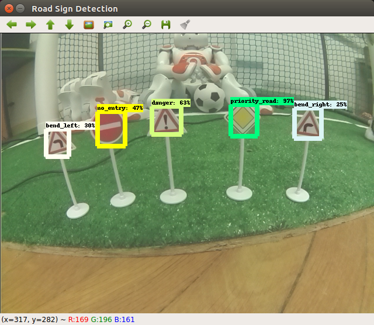

# ROSRoadSignDetection
This Repository is used for our Road Sign Detection implementation in ROS running on a TurleBot3 with a Raspberry Camera.

## Implementations

In Ansatz_1 we tried an Approach with Keras which was trained with the GTRSB Database.

In Ansatz_2 we used transfer learning from a pre-trained SSD MobileNet with a Dataset composed of Images from Google and images we made ourself. There you can find [create_tfrec.txt](Ansatz_2/create_tfrec.txt) where the commands for the training of the Roadsign Detection is described with the used commands.

In the [anaconda_dependencies.txt](anaconda_dependencies.txt) you can find the commands to install the needed dependencies.

## Final Result

